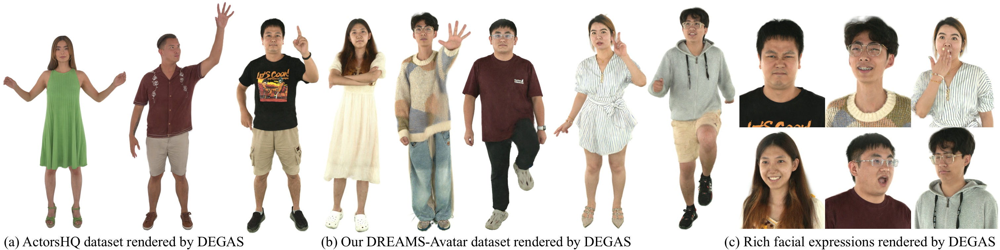
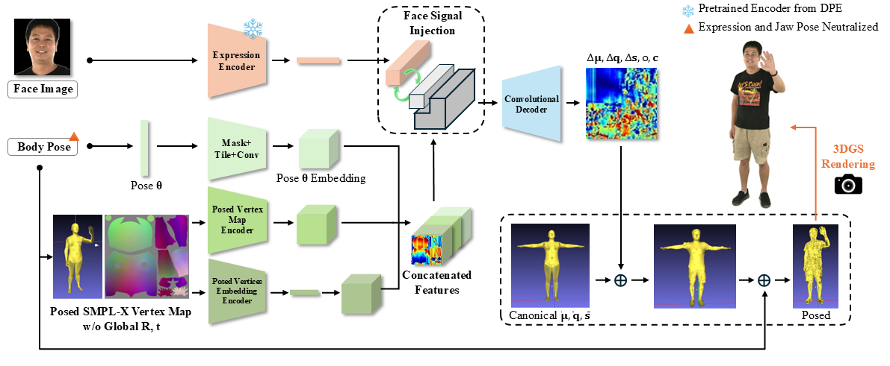

# DEGAS: Detailed Expressions on Full-Body Gaussian Avatars
## [Paper]() | [Video Youtube]() | [Project Page](https://initialneil.github.io/DEGAS)

<!-- Official Repository for CVPR 2024 paper [*SplattingAvatar: Realistic Real-Time Human Avatars with Mesh-Embedded Gaussian Splatting*](https://cvpr.thecvf.com/Conferences/2024/AcceptedPapers).  -->

 


<!-- - Overview -->
 
<!-- - Framework -->
 


<!-- ## Citation
If you find our code or paper useful, please cite as:
```
@inproceedings{SplattingAvatar:CVPR2024,
  title = {{SplattingAvatar: Realistic Real-Time Human Avatars with Mesh-Embedded Gaussian Splatting}},
  author = {Shao, Zhijing and Wang, Zhaolong and Li, Zhuang and Wang, Duotun and Lin, Xiangru and Zhang, Yu and Fan, Mingming and Wang, Zeyu},
  booktitle = {Computer Vision and Pattern Recognition (CVPR)},
  year = {2024}
}
``` -->

<!-- ## Acknowledgement
We thank the following authors for their excellent works!
- [instant-nsr-pl](https://github.com/bennyguo/instant-nsr-pl)
- [Gaussian Splatting](https://github.com/graphdeco-inria/gaussian-splatting)
- [IMavatar](https://github.com/zhengyuf/IMavatar)
- [INSTA](https://github.com/Zielon/INSTA) -->

## License
DEGAS
<br>
The code is released under the [Creative Commons Attribution-NonCommercial-ShareAlike 4.0 International Public License](https://creativecommons.org/licenses/by-nc-sa/4.0/legalcode) for Noncommercial use only. Any commercial use should get formal permission first.

[Gaussian Splatting](https://github.com/graphdeco-inria/gaussian-splatting/blob/main/LICENSE.md)
<br>
**Inria** and **the Max Planck Institut for Informatik (MPII)** hold all the ownership rights on the *Software* named **gaussian-splatting**. The *Software* is in the process of being registered with the Agence pour la Protection des Programmes (APP).  
