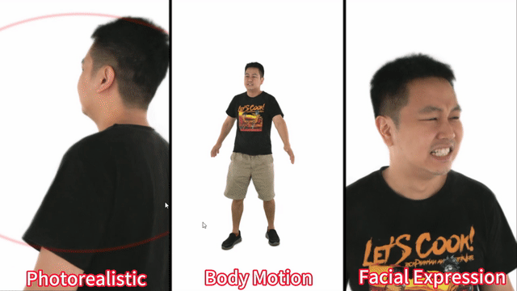
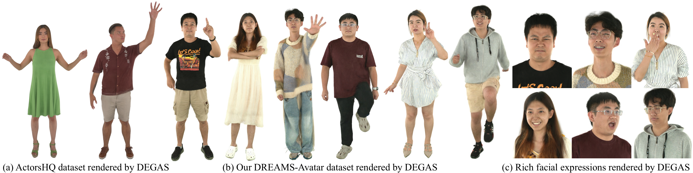
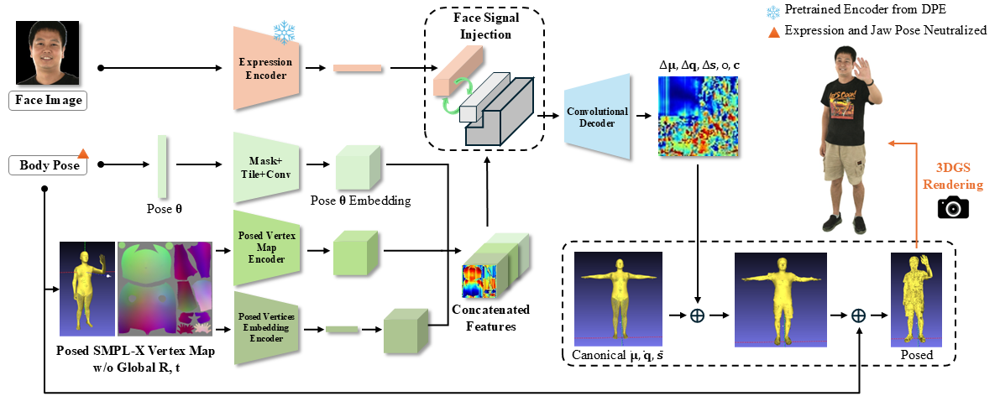

# DEGAS: Detailed Expressions on Full-Body Gaussian Avatars [](https://hitscounter.dev)
## [Paper(arXiv:2408.10588)](https://arxiv.org/abs/2408.10588) | [Video Youtube]() | [Project Page](https://initialneil.github.io/DEGAS)

<!-- Official Repository for CVPR 2024 paper [*SplattingAvatar: Realistic Real-Time Human Avatars with Mesh-Embedded Gaussian Splatting*](https://cvpr.thecvf.com/Conferences/2024/AcceptedPapers).  -->

 


<!-- - Overview -->
 
<!-- - Framework -->
 


## Release

| What | Where | Status |
| --- | --- | --- |
| Training / evaluation code | this repo | available |
| Pretrained avatars | [huggingface.co/initialneil/DEGAS](https://huggingface.co/initialneil/DEGAS) | P1 available, P2/P3/P4 uploading as they finish |
| DREAMS-AVATAR dataset | [huggingface.co/datasets/initialneil/DREAMS-AVATAR](https://huggingface.co/datasets/initialneil/DREAMS-AVATAR) | 10 captures, SMPL-X **and** DPE codes for all of them |
| Multiview SMPL-X registration | [Holistic-Multiview-Tracker](https://github.com/initialneil/Holistic-Multiview-Tracker) | available |

- [Setup](#setup)
- [Quick inference](#quick-inference-with-pretrained-avatars)
- [Re-training on DREAMS-AVATAR](#re-training-on-dreams-avatar)
- [Train your own avatar](#train-your-own-avatar)
- [Repository layout](#repository-layout)


## Setup

DEGAS unwarps the SMPL-X mesh to a 512x512 UV plane, puts one Gaussian on each UV pixel,
and lets a shallow MLP turn a 512x512x48 feature plane into each Gaussian's *offset,
rotation, scaling, colour and opacity*. A conditional VAE maps the driving signal (body
pose, plus a facial code) into that feature plane.

The released avatars were trained with Python 3.11, PyTorch 2.7 + CUDA 11.8, on a single
RTX 3090. Other recent combinations work; those are the versions the pins in
`requirements.txt` describe.

```bash
git clone --recursive https://github.com/initialneil/DEGAS
cd DEGAS

conda create -n degas python=3.11 -y && conda activate degas

# 1. PyTorch first, matching your CUDA
pip install torch==2.7.0 torchvision==0.22.0 --index-url https://download.pytorch.org/whl/cu118

# 2. the three that are not plain pip installs
pip install "git+https://github.com/facebookresearch/pytorch3d.git"
pip install "git+https://github.com/NVlabs/nvdiffrast.git"
pip install submodules/diff-gaussian-rasterization submodules/simple-knn

# 3. everything else
pip install -r requirements.txt
```

If you already cloned without `--recursive`, run `git submodule update --init --recursive`.

### SMPL-X body model

The body model is licensed separately and is **not** redistributed here. Register at
[smpl-x.is.tue.mpg.de](https://smpl-x.is.tue.mpg.de/), download the SMPL-X v1.1 neutral
model, and place it at:

```
model/data/smplx/smplx/SMPLX_NEUTRAL.npz
```

`model/data/` is gitignored, so this never lands in a commit by accident.


## Quick inference with pretrained avatars

Pretrained avatars live in the HuggingFace **model** repo
[`initialneil/DEGAS`](https://huggingface.co/initialneil/DEGAS), laid out exactly as
`degas_eval.py --model_path` expects:

```
avatars/<NAME>/config.yaml
avatars/<NAME>/point_cloud/iteration_800000/{checkpoint.pt, point_cloud.ply, smplx_refined.pt}
```

| Avatar | Trained on | Face driven by |
| --- | --- | --- |
| `P1_smplx` | P1C1 | SMPL-X expression + jaw, fitted by Holistic-Multiview-Tracker |
| `P1_dpe` | P1C1 | a per-frame 512-d DPE code, mesh face neutralised |
| `P2_smplx`, `P3_smplx`, `P4_smplx` | P2C1 / P3C1 / P4C1 | SMPL-X expression + jaw (*uploading as training finishes*) |

Fetch one avatar and the session you want to drive it with, then render:

```bash
pip install -U "huggingface_hub[cli]"

# the avatar (~1.3 GB)
hf download initialneil/DEGAS --include "avatars/P1_smplx/*" --local-dir weights

# the driving capture (P1C2 is the held-out session; P1C1 is what it was trained on)
hf download initialneil/DREAMS-AVATAR --repo-type dataset \
    --include "data/P1C2/*" --local-dir DREAMS-AVATAR

python degas_eval.py \
    --dat_dir DREAMS-AVATAR/data/P1C2 \
    --ip none \
    --model_path weights/avatars/P1_smplx \
    --configs configs/degas_config.yaml,configs/degas_vae_driver.yaml,configs/dreams/p1_train_base.yaml,configs/dreams/p1_face_B.yaml \
    dataset.cache_dir=cache/P1C2_eval_cam3 \
    dataset.test.cam_select=[3] \
    "dataset.test.frm_list=np.arange(0, 293, 8).tolist()"
```

Renders, ground truth and `stats.json` land in `weights/avatars/P1_smplx/eval_<iteration>/`.

`degas_eval.py` sets `render_config = {'mesh_from': 'batch'}`, so the avatar is posed from
whatever capture `--dat_dir` points at. Pointing it at a *different session of the same
subject* is a cross-session drive, which is how the held-out numbers are produced.

Three things are worth knowing, because each one fails quietly rather than loudly:

1. **`degas_eval.py` appends the run's saved `config.yaml` last**, so an avatar is always
   evaluated under its own face setting. Only CLI overrides outrank it, which is why the
   test split above is set on the command line.
2. **Give each capture its own `dataset.cache_dir`.** Decoded frames are named
   `cam%02d/%08d.jpg` with no capture in the path, so a shared cache would otherwise serve
   P1C1's frame 110 for P1C2's frame 110. `dataset/dreams_data.py` stamps a `capture.txt`
   into every cache dir and refuses a mismatch, so this fails loudly rather than producing
   believable nonsense, but only if you keep them separate.
3. **For a DPE avatar, make sure `dataset.with_face_dpe` points at the session you are
   driving with**, not the one the avatar was trained on. The published avatars store it
   as the *relative* value `dpe`, and `load_face_dpe` resolves relative paths against
   `dat_dir`, so they follow `--dat_dir` on their own and pick up the right codes. A config
   saved by your own training run holds an **absolute** path to the training session's
   codes instead, and there you must override it, or you will render one session's poses
   with another session's expressions.

So the `P1_dpe` avatar on the same held-out session is:

```bash
hf download initialneil/DEGAS --include "avatars/P1_dpe/*" --local-dir weights

python degas_eval.py \
    --dat_dir DREAMS-AVATAR/data/P1C2 \
    --ip none \
    --model_path weights/avatars/P1_dpe \
    --configs configs/degas_config.yaml,configs/degas_vae_driver.yaml,configs/dreams/p1_train_base.yaml,configs/dreams/p1_face_A_dpe.yaml \
    dataset.cache_dir=cache/P1C2_eval_cam3 \
    dataset.test.cam_select=[3] \
    "dataset.test.frm_list=np.arange(0, 293, 8).tolist()" \
    dataset.with_face_dpe=DREAMS-AVATAR/data/P1C2/dpe/dpe-multi-faces.zip
```

The last line is belt-and-braces here: the published `P1_dpe` would already resolve `dpe`
against `--dat_dir` and find P1C2's codes. State it anyway, so the command stays correct if
you point it at an avatar you trained yourself.

The `--configs` chain is worth one note. `degas_eval.py` requires it, and it is the same
chain you would train with, but the run's own `config.yaml` is merged *after* it, so the
face settings in `p1_face_B.yaml` / `p1_face_A_dpe.yaml` are already implied by the avatar.
Passing the matching one keeps the command honest and self-documenting; passing the *wrong*
one does not silently change how the avatar is driven.


## Re-training on DREAMS-AVATAR

[DREAMS-AVATAR](https://huggingface.co/datasets/initialneil/DREAMS-AVATAR) is read
natively, with no conversion: `frameset_type: dreams` in
[`dataset/dreams_data.py`](dataset/dreams_data.py) takes the published bundle as-is
(`cameras.json` + `smplx.npz` + `videos/camNN.mp4`) and hands the trainer exactly what the
ActorsHQ reader hands it. The mp4s are decoded lazily into `<dat_dir>/_degas_cache/`, and
only for the (camera, frame) pairs a split actually asks for.

```bash
hf download initialneil/DREAMS-AVATAR --repo-type dataset \
    --include "data/P1C1/*" --local-dir DREAMS-AVATAR

python degas_train.py \
    --dat_dir DREAMS-AVATAR/data/P1C1 \
    --ip none \
    --model_path output/P1C1_B \
    --configs configs/degas_config.yaml,configs/degas_vae_driver.yaml,configs/dreams/p1_train_base.yaml,configs/dreams/p1_face_B.yaml \
    optim.total_iteration=800000
```

**Config order matters.** `load_from_config` merges last-wins, so the capture config and
the face config must come *after* `configs/degas_config.yaml`, which would otherwise
reimpose `frameset_type: color_frames` and `smplx_nofacial: exp+jaw`.

The `configs/dreams/` files split into two kinds, so that a face comparison is never
confounded by a data difference:

- `pN_train_base.yaml` is the **data recipe** for one subject: splits, held-out view, and
  held-out session. `p1_train_base.yaml` trains on all 1836 frames of P1C1 across 29
  cameras at `2x` (1024x750), and holds out **cam03** (a tele camera, the frontal face
  closeup) plus the whole **P1C2** session.
- `pN_face_*.yaml` changes **only** how the face is driven (next section).

Training runs to 800k iterations, roughly 41 h on one 3090, checkpointing every 25k. Use
`--is_continue` (the default) to resume. `degas_train_multi.py` trains several captures in
one process; `degas_eval.py` scores a run on a held-out split.


## Train your own avatar

### 1. Multiview capture to SMPL-X

DEGAS drives everything from a registered SMPL-X sequence, so the first step is fitting
SMPL-X to your multiview capture. Use
**[Holistic-Multiview-Tracker](https://github.com/initialneil/Holistic-Multiview-Tracker)**,
which is what produced DREAMS-AVATAR: it fits body, hands and face jointly from dense
multiview landmarks and writes the per-frame SMPL-X parameters this repo consumes.

Arrange the result as a DREAMS-AVATAR capture (`cameras.json`, `capture.json`,
`smplx.npz`, `videos/camNN.mp4`) and `frameset_type: dreams` reads it directly.
[`scripts/dreams_to_actorshq.py`](scripts/dreams_to_actorshq.py) converts a capture into an
ActorsHQ tree if you would rather feed some other codebase.

### 2. Choose how the face is driven

This is the one real decision, and the repo supports both answers.

**Which one to pick, from the one comparison we ran.** On P1, with identical data, schedule
and architecture, driving the mesh with the fitted SMPL-X expression (Option A) **beat** the
real-DPE path (Option B). That is why the released `*_smplx` avatars use Option A. Option B
is the formulation in the paper, not the one that won here, and it is the right choice when
you have no trustworthy face fit.

Two caveats on that result, because it is a single subject and it is easy to over-read.
First, whole-image and even head-crop metrics could not tell the two apart at all: the
differences sat in the fourth decimal. Only a mouth region defined from the jaw-driven
SMPL-X vertices separated them (PSNR +0.58, SSIM +0.015, LPIPS -10%). A face ablation moves
about 1% of the pixels, so if you benchmark this yourself, whole-image PSNR will tell you
nothing. Second, Option A fixes the mouth *aperture*, not its *interior*: there is no
oral-cavity geometry and densification is off, so teeth render as a specular smear.

#### Option A: SMPL-X expression and jaw (default in `configs/dreams/`)

The fitted 100-dim expression and jaw pose reach the mesh, so the posed SMPL-X geometry
actually moves its face. The VAE pose driver conditions on that posed geometry, so the
appearance network sees the expression too. No new inputs, no architecture change. This is
`pN_face_B.yaml`, and it is what the `*_smplx` released avatars use.

Three settings have to agree or the expression is silently discarded somewhere:

```yaml
dataset:  {smplx_nofacial: ''}              # else reset_smplx_facial zeroes it at the reader
model:    {smplx_nofacial: ''}              # else avatar_base pops it out before deforming
optim:    {smplx_optim: {optim_skip: []}}   # "skip" means FORCED ZERO, not "frozen at the fit"
```

Use `''`, not `false`: `avatar_base` does `'exp' in config.get('smplx_nofacial', '')`, and
`'exp' in False` raises `TypeError`. A run with any one of these left at the default trains
happily for three days and produces a static face, so check it in 30 seconds first:

```bash
python tools/preflight_face_arms.py --dat_dir DREAMS-AVATAR/data/P1C1 --frames 944 903 750
```

#### Option B: neutral mesh face plus a DPE expression code

This is the paper's formulation, and it is the option to take when your face fit is not
trustworthy, or when you want to drive the face from something other than SMPL-X. In plain
terms:

1. **Neutralize the mesh's face.** Set `smplx_nofacial: exp+jaw` (in *both* `dataset` and
   `model`) and `optim_skip: [expression, jaw_pose]`. The SMPL-X expression and jaw are
   forced to zero for the whole run, so the mesh carries pose and identity but no facial
   motion at all.
2. **Drive the face with a per-frame DPE expression code instead.** A 512-d code from
   [OpenTalker/DPE](https://github.com/OpenTalker/DPE) is fed to the decoder's
   `n_face_embs` branch each frame. 512 is exactly `n_face_embs`, so nothing is reshaped,
   padded or projected anywhere.

That is `configs/dreams/p1_face_A_dpe.yaml`, and it is what the `P1_dpe` released avatar
uses.

**Generating the codes.** [`scripts/extract_dpe_codes.py`](scripts/extract_dpe_codes.py)
produces them in the form the loader expects:

```bash
git clone https://github.com/OpenTalker/DPE && export DPE_ROOT=$PWD/DPE
# download DPE's pretrained dpe.pt into $DPE_ROOT/checkpoints/

python scripts/extract_dpe_codes.py \
    --capture DREAMS-AVATAR/data/P1C1 \
    --cams 7 30 \
    --out DREAMS-AVATAR/data/P1C1/dpe
```

The code is `mlp_exp(dir(mlp(enc(face_crop))))`, traced through DPE's `Generator(size=256,
style_dim=512, motion_dim=20)`. That is the exact tensor DPE's own `dec_exp` consumes, so
it carries expression and nothing else. `enc.net_app` takes one image, so the code is an
absolute per-frame function: there is no source or reference frame to choose, and no
convention to get wrong. The face box comes from S3FD on one reference frame, expanded by
50 px, then held fixed for the sequence, which is what DPE's own `crop_video.py` does.

Two choices in that command are load-bearing:

- **Use frontal cameras that are in the training split.** P1 used cam07 and cam30, both
  frontal tele views. Never pass a held-out evaluation camera: its pixels would leak into
  the face conditioning and the evaluation would flatter itself.
- **Use more than one camera.** The output zip is keyed by frame id
  (`dpe-{frame:06d}-cam{cc:02d}.pt`), and `load_face_dpe` concatenates the per-camera codes
  for a frame and samples a random convex combination each iteration. One camera leaves
  that augmentation with nothing to mix.

Three more properties of this path that are easy to be surprised by:

- **The face crop is a FIXED box, not per-frame tracking.** S3FD detects once on a
  reference frame, the box is padded by 50 px per side, and that box is then reused
  unchanged for the whole sequence. This is not a shortcut here, it is what DPE's own
  `crop_video.py` does. The consequence is real: a subject who moves substantially out of
  that box degrades, and nothing re-detects to save you.
- **The reference frame defaults to mid-sequence** (`frames[len // 2]`), not frame 0, which
  is where P1C1's 918 comes from. No capture used a hand-picked reference. It is recorded
  per capture as `ref_frame` in `dpe_meta.json`, and the resulting box as
  `stats.<cam>.box`, so every published code set is reproducible from its own metadata.
- **The camera mix is stochastic, and it runs at eval time too.** `__getitem__` draws
  `w ~ U(0,1)^N`, normalises it, and returns `einsum('i,ij->j', w, codes)`, redrawn on
  every sample. That is deliberate augmentation during training, but the same code path
  runs during evaluation, so a DPE-arm evaluation is **not deterministic** across cameras.
  If you need reproducible numbers, restrict the eval to a single camera per frame; that
  is the knob.

Then check the codes are worth 40 h of GPU before spending it:

```bash
python tools/validate_dpe_codes.py \
    --capture DREAMS-AVATAR/data/P1C1 --codes DREAMS-AVATAR/data/P1C1/dpe

python tools/probe_face_embs.py --dat_dir DREAMS-AVATAR/data/P1C1 \
    --configs configs/degas_config.yaml,configs/degas_vae_driver.yaml,configs/dreams/p1_train_base.yaml,configs/dreams/p1_face_A_dpe.yaml
```

`validate_dpe_codes.py` asks whether the codes are non-degenerate, whether they separate
open-mouth from closed-mouth frames, and whether they track expression rather than head
pose in disguise. `probe_face_embs.py` hooks the layer that consumes the code and reports
what it actually received, because `degas_vae_driver.py` substitutes constant zeros when no
code arrives. That substitution is silent: a run with a misconfigured DPE path looks
completely healthy for three days and produces a frozen face.

### 3. Train

Write a `pN_train_base.yaml` for your capture (copy `configs/dreams/p1_train_base.yaml` and
change the splits), pick a face config, and run the `degas_train.py` command from the
previous section.


## Repository layout

```
degas_train.py            train one avatar
degas_train_multi.py      train several captures in one process
degas_eval.py             render + score a trained avatar on a held-out split

configs/
  degas_config.yaml       base model / optim / dataset defaults
  degas_vae_driver.yaml   the conditional VAE pose driver (n_face_embs: 512 lives here)
  dreams/                 per-subject data recipes + the two face options
  actorshq/               ActorsHQ configs

dataset/
  dreams_data.py          DREAMS-AVATAR native reader (frameset_type: dreams)
  actorshq_data.py        ActorsHQ reader
  frameset_data.py        the generic color_frames reader
  dataset_utils.py        load_face_dpe / load_face_DAD, reset_smplx_facial
  dataset_helper.py       frameset_type dispatch

model/
  degas_model.py          UV-plane Gaussians
  degas_vae_driver.py     conditional VAE pose driver
  bone_deformer/          SMPL-X deformation and SMPLXOptimizer
  ca_body/, libcore/      supporting code

scripts/
  dreams_to_actorshq.py   DREAMS-AVATAR capture -> ActorsHQ tree
  extract_dpe_codes.py    per-frame 512-d DPE expression codes

tools/
  preflight_face_arms.py  do expression/jaw actually reach the mesh?
  probe_face_embs.py      is the DPE branch receiving codes, or substituted zeros?
  validate_dpe_codes.py   are the generated codes non-degenerate and expression-tracking?
  prebuild_cache.py       decode a capture's frames up front
```


## Citation
If you find our code or paper useful, please cite as:
```
@misc{shao2024degas,
  title={DEGAS: Detailed Expressions on Full-Body Gaussian Avatars}, 
  author={Zhijing Shao and Duotun Wang and Qing-Yao Tian and Yao-Dong Yang and Hengyu Meng and Zeyu Cai and Bo Dong and Yu Zhang and Kang Zhang and Zeyu Wang},
  year={2024},
  eprint={2408.10588},
  archivePrefix={arXiv},
  primaryClass={cs.CV},
  url={https://arxiv.org/abs/2408.10588}, 
}
```

## Acknowledgement
We thank the following authors for their excellent works!
- [instant-nsr-pl](https://github.com/bennyguo/instant-nsr-pl)
- [Gaussian Splatting](https://github.com/graphdeco-inria/gaussian-splatting)
- [CABody](https://github.com/facebookresearch/ca_body)
- [AnimatableGaussians](https://github.com/lizhe00/AnimatableGaussians)
- [DECA](https://github.com/yfeng95/DECA)
- [DAD-3DHeads](https://github.com/PinataFarms/DAD-3DHeads)
- [Deep3DFaceRecon](https://github.com/sicxu/Deep3DFaceRecon_pytorch)
- [EasyMocap](https://github.com/zju3dv/EasyMocap)
- [DPE](https://github.com/OpenTalker/DPE)

## License
DEGAS
<br>
The code is released under the [Creative Commons Attribution-NonCommercial-ShareAlike 4.0 International Public License](https://creativecommons.org/licenses/by-nc-sa/4.0/legalcode) for Noncommercial use only. Any commercial use should get formal permission first.

[Gaussian Splatting](https://github.com/graphdeco-inria/gaussian-splatting/blob/main/LICENSE.md)
<br>
**Inria** and **the Max Planck Institut for Informatik (MPII)** hold all the ownership rights on the *Software* named **gaussian-splatting**. The *Software* is in the process of being registered with the Agence pour la Protection des Programmes (APP).  
